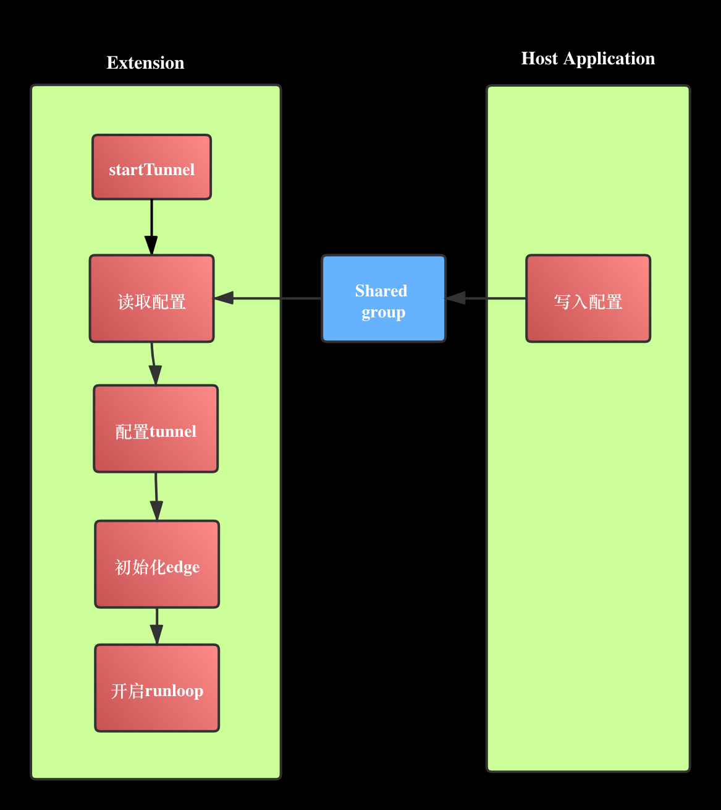
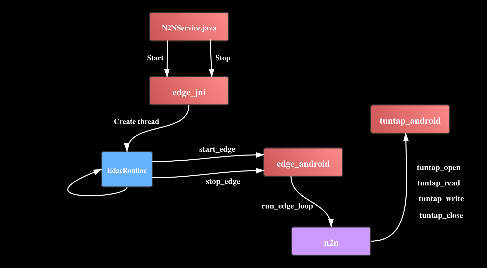
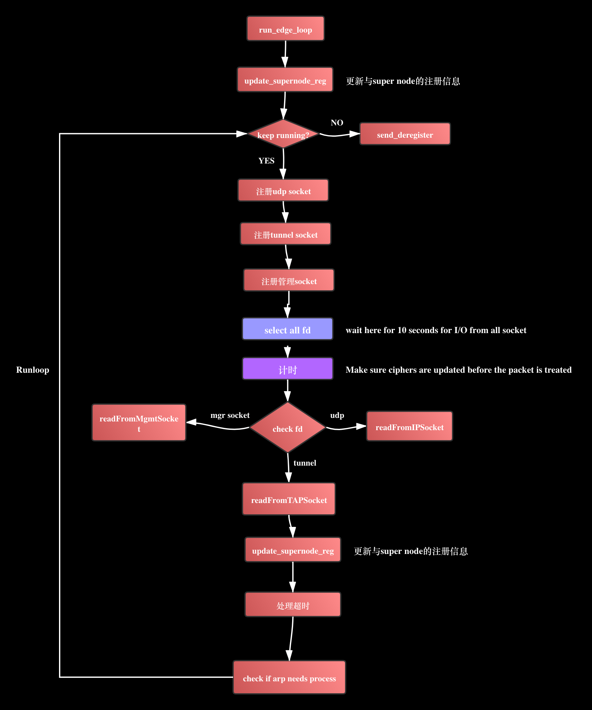
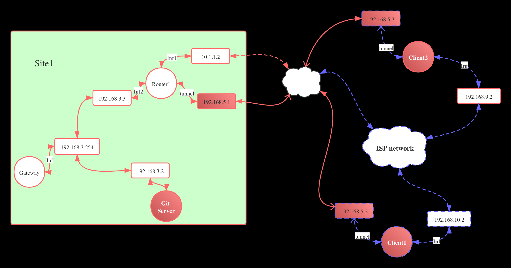
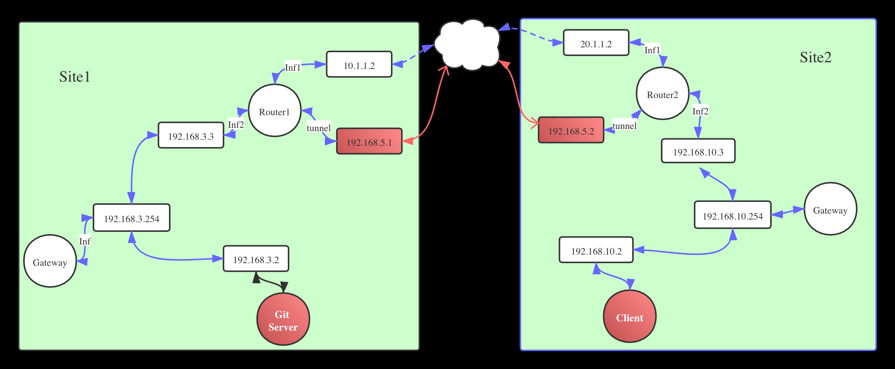
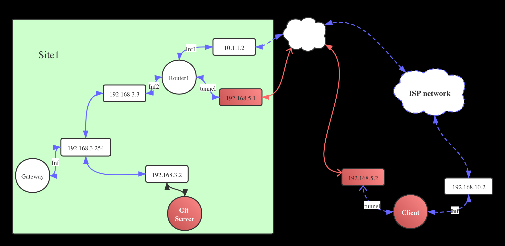
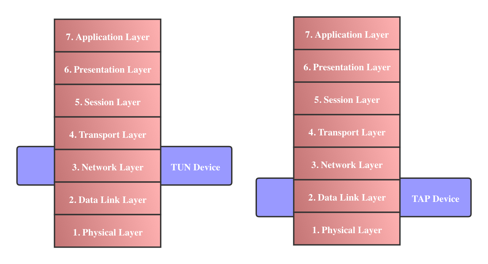
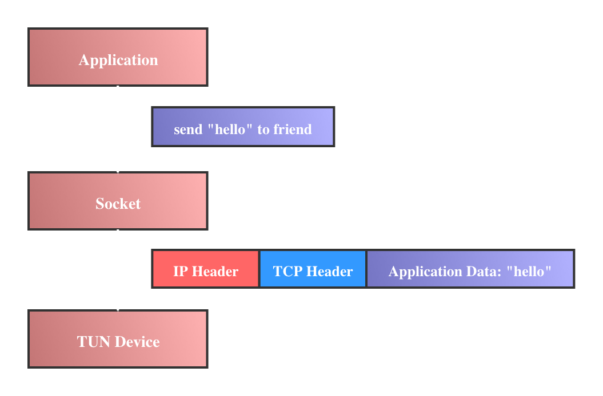
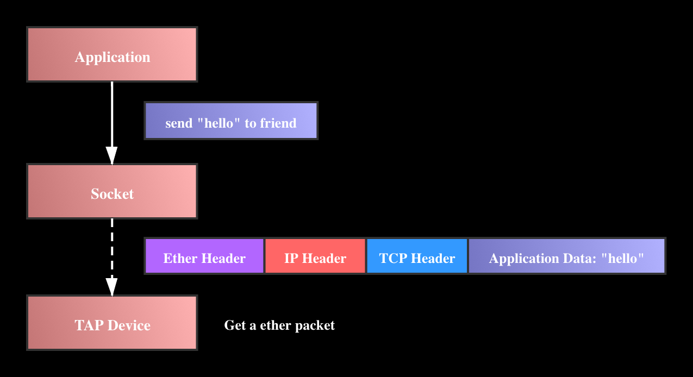

OmniEdge on iOS

<!-- TOC -->

- [5. N2N On iOS](#5-n2n-on-ios)
    - [5.1 配置Tunnel初始化edge](#51-配置tunnel初始化edge)
- [4. N2N On Android](#4-n2n-on-android)
    - [4.1 配置Tun初始化edge](#41-配置tun初始化edge)
        - [4.1.1 配置Tun设备](#411-配置tun设备)
        - [4.1.2 调用JNI创建线程](#412-调用jni创建线程)
        - [4.1.3 启动N2N runloop](#413-启动n2n-runloop)
    - [4.3 Main Runloop](#43-main-runloop)
    - [4.2 IP Packet读写](#42-ip-packet读写)
    - [4.3 数据转发](#43-数据转发)
        - [4.3.1 向supernode发送信息](#431-向supernode发送信息)
        - [4.3.2 向remote edge发送数据](#432-向remote-edge发送数据)
    - [4.5 ARP协议](#45-arp协议)
- [4. DNS on VPN](#4-dns-on-vpn)
- [3. Peer to Peer VPN](#3-peer-to-peer-vpn)
- [2.VPN](#2vpn)
    - [2.1 Site to Site(点对点)](#21-site-to-site点对点)
    - [2.2 End to Site](#22-end-to-site)
- [1. TUN/TAP Device (TUN/TAP设备)](#1-tuntap-device-tuntap设备)
    - [1.1 TUN设备](#11-tun设备)
    - [1.2 TAP设备](#12-tap设备)
- [参考](#参考)

<!-- /TOC -->


# 5. N2N On iOS

iOS系统与Android相同, 系统没有提供tuntap虚拟设备, 只提供了tun设备, 因此需要利用uip实现arp功能, 从而实现tap设备功能.

iOS中的tun设备是在NetworkExtension中实现的:

```
class PacketTunnelProvider: NEPacketTunnelProvider {
    ...
    override func startTunnel(options: [String : NSObject]?, completionHandler: @escaping (Error?) -> Void) {
    }
    ...
}
```

## 5.1 配置Tunnel初始化edge

当tun设备开启时, startTunnel函数会被调用, 在这里进行配置以及初始化操作.




# 4. N2N On Android

Android系统用VpnService实现了一个Tun设备, 通过这个设备可以进行路由配置与数据读写.

主要功能集中在4个模块中:

> N2NService.java

与系统交互

> edge_jni.c

用JNI封装C函数供Java层调用, runloop线程在此创建.
- Java_io_omniedge_n2n_N2NService_startEdge
- Java_io_omniedge_n2n_N2NService_stopEdge
- Java_io_omniedge_n2n_N2NService_getEdgeStatus

调用pthread_create创建线程:
```
...
JNIEXPORT jboolean JNICALL Java_io_omniedge_n2n_N2NService_startEdge(
        JNIEnv *env,
        jobject this,
        jobject jcmd) {
    ...
        int ret = pthread_create(&status.tid, NULL, EdgeRoutine, NULL);
    if (ret != 0) {
        ResetEdgeStatus(env, 1 /* cleanup*/);
        return JNI_FALSE;
    }
    ...
}
```
线程主函数EdgeRoutine调用start_edge_v2, 开启runloop

> edge_android

调用n2n实现主要的功能.
- int start_edge(const n2n_edge_cmd_t* cmd) //开启runloop
- int stop_edge(void); //退出runloop
- void report_edge_status(void);

> tuntap_android

调用uip,实现tap设备功能
- int tuntap_open(...)
- int tuntap_read(...)
- int tuntap_write(...)
- void tuntap_close(...)
- void tuntap_get_address(...)



## 4.1 配置Tun初始化edge

```
...
public class N2NService extends VpnService {
...
public int onStartCommand(Intent intent, int flags, int startId) {
    ...
    ...
}
...
}
...
```
Android的tun设备被系统设置为active后, 会收到启动消息: onStartCommand, 在这里读取配置信息, 利用VpnService.Builder进行配置(N2NService.java).

### 4.1.1 配置Tun设备

- 设置MTU
- 设置虚拟网卡的IP
- 设置虚拟网卡的路由(哪些IP地址的数据要转发到该虚拟网卡)

```
...
    Builder b = new Builder();
    b.setMtu(n2nSettingInfo.getMtu());
    String ipAddress = n2nSettingInfo.getIp();
    b.addAddress(ipAddress, getIpAddrPrefixLength(n2nSettingInfo.getNetmask()));
    String route = getRoute(ipAddress, getIpAddrPrefixLength(n2nSettingInfo.getNetmask()));
    b.addRoute(route, getIpAddrPrefixLength(n2nSettingInfo.getNetmask()));
```
### 4.1.2 调用JNI创建线程

配置完成后, 构造参数, 传入JNI开启edge:
```
cmd = new EdgeCmd();
cmd.ipAddr = n2nSettingInfo.getIp();
cmd.ipNetmask = n2nSettingInfo.getNetmask();
cmd.supernodes = new String[2];
cmd.supernodes[0] = n2nSettingInfo.getSuperNode();
cmd.supernodes[1] = n2nSettingInfo.getSuperNodeBackup();
cmd.community = n2nSettingInfo.getCommunity();
cmd.encKey = n2nSettingInfo.getPassword();
cmd.encKeyFile = null;
cmd.macAddr = n2nSettingInfo.getMacAddr();
cmd.mtu = n2nSettingInfo.getMtu();
cmd.reResoveSupernodeIP = n2nSettingInfo.isResoveSupernodeIP();
cmd.localPort = n2nSettingInfo.getLocalPort();
cmd.allowRouting = n2nSettingInfo.isAllowRouting();
cmd.dropMuticast = n2nSettingInfo.isDropMuticast();
cmd.traceLevel = n2nSettingInfo.getTraceLevel();
cmd.vpnFd = mParcelFileDescriptor.detachFd();

try {
    mStartResult = startEdge(cmd);
    if (!mStartResult) {
        EventBus.getDefault().post(new ErrorEvent());
    }
} catch (Exception e) {
    e.printStackTrace();
}
```

JNI中对应的service是Java_wang_switchy_hin2n_service_N2NService_startEdge, 在这里检查传入的参数, 然后用EdgeRoutine函数创建线程开启runloop(edge_jni.c):

```
JNIEXPORT jboolean JNICALL Java_wang_switchy_hin2n_service_N2NService_startEdge(
        JNIEnv *env,
        jobject this,
        jobject jcmd) {
#ifndef NDEBUG
    __android_log_write(LOG_DEBUG, "edge_jni", "in start");
#endif /* #ifndef NDEBUG */
    if (GetEdgeCmd(env, jcmd, &cmd) != 0) {
        goto ERROR;
    }
    ...
    pthread_mutex_init(&status.mutex, NULL);
    int ret = pthread_create(&tid, NULL, EdgeRoutine, &cmd);
    if (ret != 0) {
        tid = -1;
        goto ERROR;
    }
    ....
```

EdgeRoutine函数调用start_edge启动n2n:
```
void* EdgeRoutine(void* cmd) {
    int flag = 0;
    if (jvm) {
        JNIEnv* env = NULL;
        if ((*jvm)->AttachCurrentThread(jvm, &env, NULL) == JNI_OK) {
            flag = 1;
        }
    }
    n2n_edge_cmd_t* c = cmd;
    int ret = start_edge(c);
    free(c->enc_key);
    free(c->enc_key_file);
    c->enc_key = NULL;
    c->enc_key_file = NULL;
    if (flag && jvm) {
        (*jvm)->DetachCurrentThread(jvm);
    }
    return (void*)ret;
}
```

### 4.1.3 启动N2N runloop

edge_android.c

```
int start_edge(const n2n_edge_cmd_t* cmd) {
    ...
}
```

## 4.3 Main Runloop

在Android中, 开启了一个独立的线程, 对tunnel, udp_socket还有一个用于管理的soket进行select.

```
int run_edge_loop(n2n_edge_t * eee, int *keep_running) {
...
while(*keep_running) {
...
}
...
}
```



## 4.2 IP Packet读写

利用VpnService.Builder生成文件句柄, 对虚拟网卡的读写操作就是通过这个文件句柄来完成.

```
//创建文件描述符
ParcelFileDescriptor mParcelFileDescriptor = b.setSession("N2N").establish();

//得到文件句柄, 此后就可以通过对文件读写进行数据交互
int fd = mParcelFileDescriptor.detachFd();
```

创建的fd被传入tuntap->fd, 收发数据对应的就是对fd的读写:

```
//读取数据, 表明有IP数据报被转发到了虚拟网卡
...
int tuntap_read(struct tuntap_dev *tuntap, unsigned char *buf, int len) {
    int rlen = read(tuntap->fd, buf + UIP_LLH_LEN, len - UIP_LLH_LEN);
    if ((rlen <= 0) || (rlen > N2N_PKT_BUF_SIZE - UIP_LLH_LEN))
    {
        return rlen;
    }
    ...
}

//写入数据, 把IP数据报发送给上层应用
...
int tuntap_write(struct tuntap_dev *tuntap, unsigned char *buf, int len) {
    uip_buf = buf;
    uip_len = len;
    if (IPBUF->ethhdr.type == htons(UIP_ETHTYPE_IP)) {
        return write(tuntap->fd, buf + UIP_LLH_LEN, len - UIP_LLH_LEN);
    } 
}
...
```

该虚拟网卡是一个Tun设备, 因此读写的数据报都是IP Packet.

## 4.3 数据转发

虚拟网卡Tun设备接收到的IP Packet需要转发到VPN Server, Android是通过一个UDP Socket来进行数据转发的.

```
...
/** Send a datagram to a socket defined by a n2n_sock_t */
static ssize_t sendto_sock(int fd, const void * buf,
			   size_t len, const n2n_sock_t * dest) {
  struct sockaddr_in peer_addr;
...
  fill_sockaddr((struct sockaddr *) &peer_addr,
		sizeof(peer_addr),
		dest);

  sent = sendto(fd, buf, len, 0/*flags*/,
		(struct sockaddr *)&peer_addr, sizeof(struct sockaddr_in));
  if(sent < 0) {
      ...
  } else {
      ...
    }
...

}
...

```

数据转发会发送给supernode或者remote peer:

### 4.3.1 向supernode发送信息

```
//查询注册信息
static void send_register_super(n2n_edge_t * eee,
				const n2n_sock_t * supernode) {
...
sendto_sock(eee->udp_sock, pktbuf, idx, supernode);
...
}

//查询peer信息
static void send_query_peer( n2n_edge_t * eee,
                             const n2n_mac_t dstMac) {
...
sendto_sock( eee->udp_sock, pktbuf, idx, &(eee->supernode) );
...
}

```

### 4.3.2 向remote edge发送数据

```
/** Send a REGISTER packet to another edge. */
static void send_register(n2n_edge_t * eee,
		   const n2n_sock_t * remote_peer,
		   const n2n_mac_t peer_mac) {
...
sendto_sock(eee->udp_sock, pktbuf, idx, remote_peer);
...
}

/** Send a REGISTER_ACK packet to a peer edge. */
static void send_register_ack(n2n_edge_t * eee,
			      const n2n_sock_t * remote_peer,
			      const n2n_REGISTER_t * reg) {
...
sendto_sock(eee->udp_sock, pktbuf, idx, remote_peer);
...                      
}

/** Send an ecapsulated ethernet PACKET to a destination edge or broadcast MAC
 *  address. */
static int send_packet(n2n_edge_t * eee,
		       n2n_mac_t dstMac,
		       const uint8_t * pktbuf,
		       size_t pktlen) {
}
```

## 4.5 ARP协议

# 4. DNS on VPN

以内网为例: family.baidu.com
ping family.baidu.com, ping不通.

# 3. Peer to Peer VPN



如果Client1与Client2能Peer to Peer通信, 那么就可以减轻Server的负担.

# 2.VPN

Virtual Private Network

## 2.1 Site to Site(点对点)

点对点是在两个site的路由器之间建立tunnel. 比如CompanyB有2个Site分布在2个城市Site1和Site2, 在Site1中有一个代码服务器Git Server内网地址是192.168.3.2, 由于是内部资源因此不能对外网公开, 只能使用内网IP地址访问, 那么Site2中的某个Client该如何访问呢? 答案就是VPN, 在Router1和Router2上新建了一个虚拟网络设备,搭建一个tunnel, 这样Router1和Router2之间就有了一条直连的安全通道.



> 路由

Router2有3个网络接口:
- Inf1: 20.1.1.2, 公网接口
- Inf2: 192.168.10.3, 内网接口
- tunnel: 192.168.5.2, VPN接口

Router2中维护一个路由表:
|目标地址|路由|说明|
|:-:|:-:|:-|
|20.1.1.0|Inf1|公网地址走Inf1公网接口|
|192.168.10.0|Inf2|内网地址走Inf2内网接口|
|192.168.5.0|tunnel|走vpn|
|0.0.0.0|Inf1|默认都走公网接口|

基于这个路由表, 当Client访问外网网站时, 路由器会将数据发送到外网, 当Client访问Site1的Git Server的时候, 路由器会把数据路由到tunnel网络.

## 2.2 End to Site



Client需要自己配置与Server的tunnel连接, 并配置路由, 决定那些连接要分发到VPN Server, 那些走ISP连接.


# 1. TUN/TAP Device (TUN/TAP设备)

TUN/TAP设备是操作系统内核中虚拟的网络设备, 用户应用程序可以像使用物理网络设备(网卡)一样使用TUN/TAP设备.



## 1.1 TUN设备
TUN设备是虚拟网络层设备, 可以对第三层IP数据包进行操作, 意思是指TUN设备接收和发送的数据包是IP数据包, 结构是这样的:



TUN设备通常用来做路由.

## 1.2 TAP设备

TAP设备是第二层数据链路层设备, 可以对第二层的数据包比如以太网包进行操作, TAP设备读取和发送的数据包是以太网数据包:



TAP设备通常用来做网桥.

# 参考

https://kean.blog/post/packet-tunnel-provider

